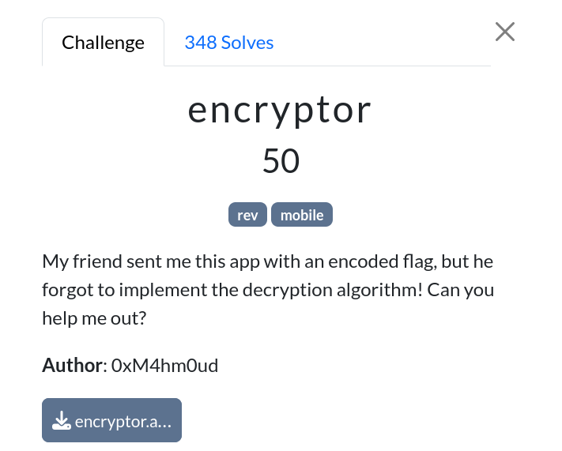

# Encryptor

|              |                                                                                    |
| ------------ | ---------------------------------------------------------------------------------- |
| **CTF**      | [Cyberspace CTF](https://2024.csc.tf/) [(CTFtime)](https://ctftime.org/event/2428) |
| **Author**   | [0xM4hm0ud](https://github.com/0xM4hm0ud)                                          |
| **Category** | beginner                                                                           |
| **Solves**   | 348                                                                                |
| **Files**    | [encryptor.apk](encryptor.apk)                                                     |



# Solution

We received an APK file. Let's open it in `jadx-gui`.

Inside `MainActivity`, we can see a few interesting functions:

```java
private String getKey() {
    return new String(Base64.decode("ZW5jcnlwdG9yZW5jcnlwdG9y".getBytes(), 0));
}

private String encryptText(String str) throws InvalidKeyException, UnsupportedEncodingException, NoSuchPaddingException, NoSuchAlgorithmException, IllegalBlockSizeException, BadPaddingException {
    SecretKeySpec secretKeySpec = new SecretKeySpec(getKey().getBytes("UTF-8"), "Blowfish");
    Cipher cipher = Cipher.getInstance("Blowfish");
    if (cipher == null) {
        throw new Error();
    }
    cipher.init(1, secretKeySpec);
    return Build.VERSION.SDK_INT >= 26 ? new String(Base64.encode(cipher.doFinal(str.getBytes("UTF-8")), 0)) : "";
}

public void encrypt_onClick(View view) throws UnsupportedEncodingException, NoSuchPaddingException, IllegalBlockSizeException, NoSuchAlgorithmException, BadPaddingException, InvalidKeyException {
    this.builder.setMessage(encryptText(((TextView) findViewById(R.id.input)).getText().toString())).setCancelable(true);
    AlertDialog create = this.builder.create();
    create.setTitle("Here's your encrypted text:");
    create.show();
    View findViewById = create.findViewById(android.R.id.message);
    if (findViewById instanceof TextView) {
        ((TextView) findViewById).setTextIsSelectable(true);
    }
}

public void getflag_onClick(View view) {
        this.builder.setMessage(readAssetFile(this, "enc.txt")).setCancelable(true);
        AlertDialog create = this.builder.create();
        create.setTitle("Here's the encrypted flag:");
        create.show();
        View findViewById = create.findViewById(android.R.id.message);
        if (findViewById instanceof TextView) {
            ((TextView) findViewById).setTextIsSelectable(true);
        }
    }
```

To obtain the flag, we need to call `getflag_onClick`. This function reads an assets file called `enc.txt`, which contains the encrypted text.

The app also encrypts other text that we provide, using the `Blowfish` algorithm. It first retrieves the key, which is base64 encoded. After decoding `ZW5jcnlwdG9yZW5jcnlwdG9y`, we get `encryptorencryptor`.

Now we know that the flag is encrypted with Blowfish and this key. We can create a Python script to decrypt the flag. You can find the encrypted flag by checking the `assets` folder in `jadx-gui` or using `apktool`.

The script looks like this:

```py
from base64 import b64decode

from Crypto.Cipher import Blowfish
from Crypto.Util.Padding import unpad

key = b"encryptorencryptor"
encoded_data = (
    b"OIkZTMehxXAvICdQSusoDP6Hn56nDiwfGxt7w/Oia4oxWJE3NVByYnOMbqTuhXKcgg50DmVpudg="
)

encrypted_data = b64decode(encoded_data)
cipher = Blowfish.new(key, Blowfish.MODE_ECB)

decrypted_data = unpad(cipher.decrypt(encrypted_data), Blowfish.block_size)
print(decrypted_data.decode("utf-8")) # CSCTF{3ncrypt0r_15nt_s4Fe_w1th_4n_h4Rdc0d3D_k3y!}
```
