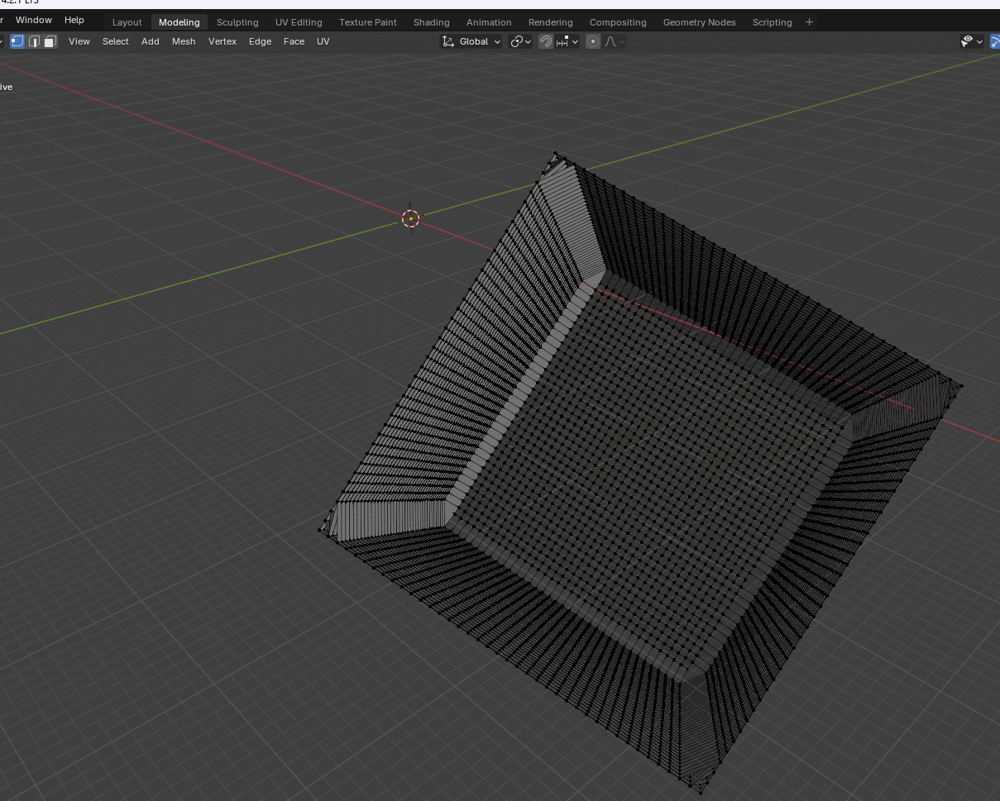
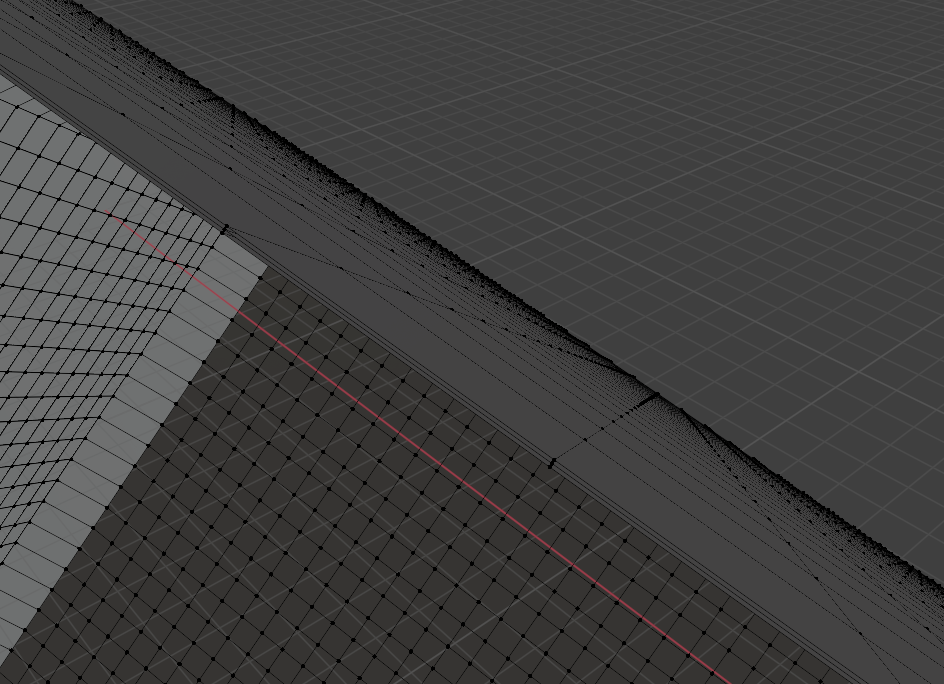
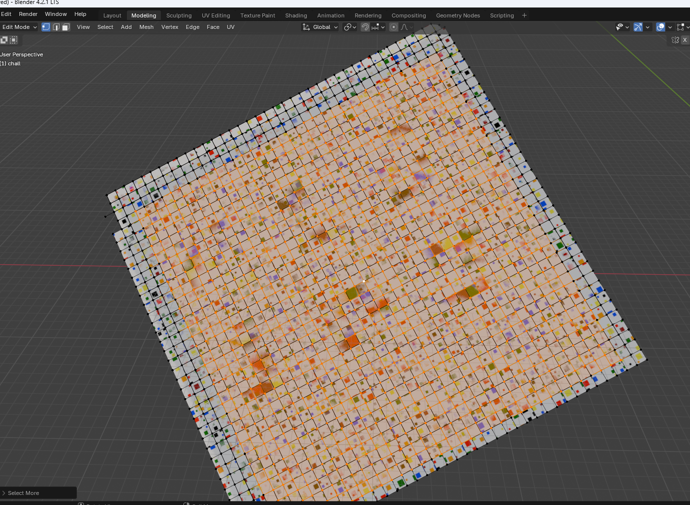
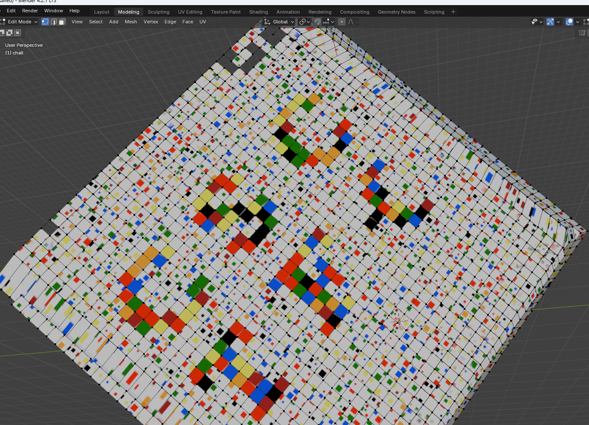

# 3D Obj

|              |                                                                                    |
| ------------ | ---------------------------------------------------------------------------------- |
| **CTF**      | [Cyberspace CTF](https://2024.csc.tf/) [(CTFtime)](https://ctftime.org/event/2428) |
| **Author**   | aa.crypto                                                                          |
| **Category** | forensics                                                                          |
| **Solves**   | 81                                                                                 |

# Solution

When you open the cube 3D model in blender and delete one side of the cube,

you could notice from 4 of the 6 sides, there are 3 layers of planes very close to each other (0.01 apart), (or you could also notice on those 4 sides, the inner layer texture is different from the outer layer texture, suggesting there are indeed multiple layers)

Normally you could select vertices and delete them to reveal the sandwiched layer, but at 0.01 apart, there are some issues in blender which deleted more vertices than it should. The workaround is to select a vertex close to the centre of the plane, and press `Ctrl` with `+` to expand the selected vertices.

Once you delete the 2 outer layers, you can view the flag clearly.

This chall is done by manipulating the UV map of the entire obj to show desired patterns (characters) as texture.
