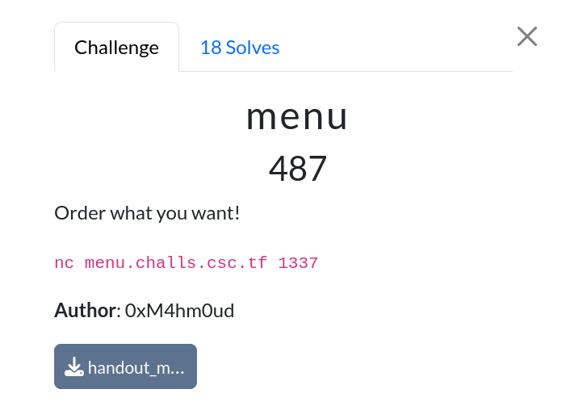
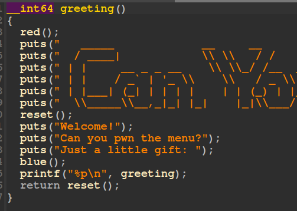
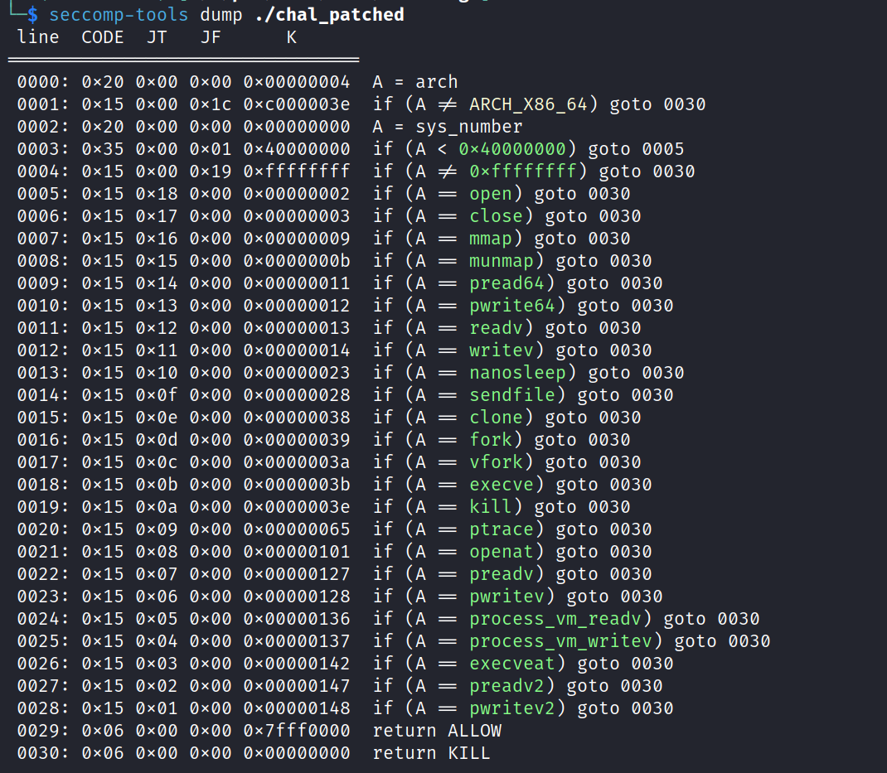

# Menu

|              |                                                                                    |
| ------------ | ---------------------------------------------------------------------------------- |
| **CTF**      | [Cyberspace CTF](https://2024.csc.tf/) [(CTFtime)](https://ctftime.org/event/2428) |
| **Author**   | [0xM4hm0ud](https://github.com/0xM4hm0ud)                                          |
| **Category** | Pwn                                                                                |
| **Solves**   | 18                                                                                 |
| **Files**    | [handout_menu.zip](handout_menu.zip)                                               |

# Solution

We received a binary, a fake flag file, a libc file, and a linker file. Let's patch the binary using `pwninit`.

When we check the protections with `checksec`, we can see that everything is enabled except for the stack canary.

Next, let's reverse-engineer the binary. In the `greeting` function, we can see that it provides a PIE leak:

Inside the `init_proc` function, it calls `sandbox`, which sets up seccomp.

Let's analyze it using `seccomp-tools`:

We can see that many syscalls are blocked. In the `menu` function, we can observe a buffer overflow vulnerability.

We can input up to 2000 characters using the `read` function, which will overflow the buffer:

So, what can we do?

Since `Full RELRO` is enabled, we can't overwrite the `GOT`. We also can't call `system` due to seccomp restrictions.

However, we noticed that `read` and `write` syscalls are not blocked, while `open` and `openat` are. Fortunately, `openat2` is not blocked.

This means we can open, read, and write the flag. First, we need to leak the libc base address so that we can call `mprotect` (which is also not blocked) to make a region RWX (read, write, execute). Then, we can write our shellcode to that region and execute it.

When searching for a `pop rdi; ret` gadget in the binary, we can't find it. However, we can still leak libc by calling `printf` followed by `puts`. When `printf` returns, it will place a pointer to `_funlockfile` in the rdi register, which points to libc. This way, we can leak the libc address.

> [!TIP]
> This also works when you have `gets`. You can read more about it [here](https://sashactf.gitbook.io/pwn-notes/pwn/rop-2.34+/ret2gets). It's a great explanation.

The full script can be seen [here](solve.py).
