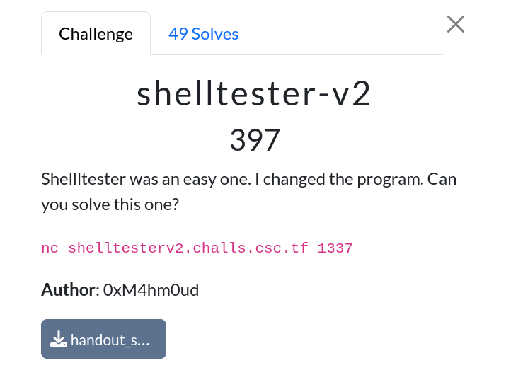
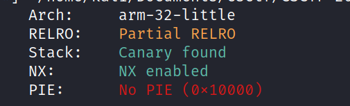
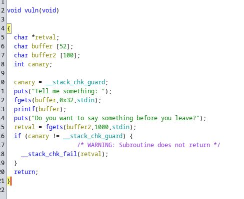

# Shelltester v2

|              |                                                                                    |
| ------------ | ---------------------------------------------------------------------------------- |
| **CTF**      | [Cyberspace CTF](https://2024.csc.tf/) [(CTFtime)](https://ctftime.org/event/2428) |
| **Author**   | [0xM4hm0ud](https://github.com/0xM4hm0ud)                                          |
| **Category** | Pwn                                                                                |
| **Solves**   | 49                                                                                 |
| **Files**    | [handout_shelltesterv2.zip](handout_shelltesterv2.zip)                             |

# Solution

We received a binary file. Let's first check the type of binary and its protections:

We can see that it's an ARM binary. NX and canary protections are enabled, and the GOT has partial RELRO protection. However, PIE is not enabled.

We are also provided with a `qemu-arm-static` binary, in case we don't have an ARM machine available. Now, let's reverse the binary:

We can identify a format string vulnerability and a buffer overflow. Since this is an ARM binary, we can't use standard techniques like ret2libc.

The binary is statically linked, so it includes many gadgets, and even contains `/bin/sh` and `system`.

To exploit this, we can leak the canary via the format string vulnerability. After that, we can overflow the buffer and use a gadget like `pop {r0, r4, pc}`.

This gadget will pop the next value into `r0`, the second value into `r4`, and then jump to the address in `pc`. By placing `/bin/sh` in `r0`, some random value in `r4`, and `system` in `pc`, we can effectively call `system("/bin/sh")`.

The full script can be seen [here](solve.py).
