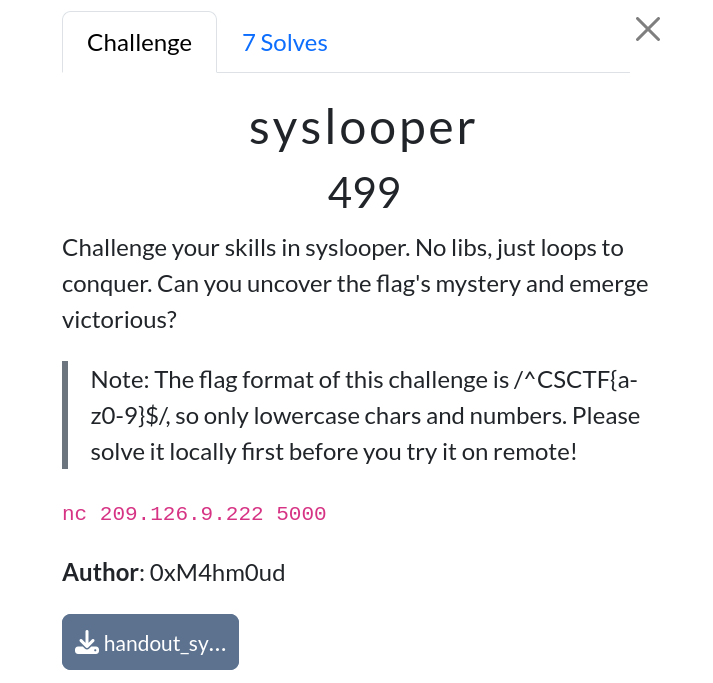

# Syslooper

|              |                                                                                    |
| ------------ | ---------------------------------------------------------------------------------- |
| **CTF**      | [Cyberspace CTF](https://2024.csc.tf/) [(CTFtime)](https://ctftime.org/event/2428) |
| **Author**   | [0xM4hm0ud](https://github.com/0xM4hm0ud)                                          |
| **Category** | Pwn                                                                                |
| **Solves**   | 7                                                                                  |
| **Files**    | [handout_syslooper.zip](handout_syslooper.zip)                                     |

# Solution

This is an SROP challenge with a few small twists. We can see that seccomp is applied to the main binary, and the child process inherits it. Only a few syscalls are allowed.

To solve this, we need to open the flag, read it into the `.bss` section, and then leak it somehow, since `write` is not allowed. We can leak the flag using an oracle.

The oracle I used works as follows:

1. Call `open` multiple times until the fd matches the character we want.
2. Prepare the SROP chain so that we can call `read` later with the correct register values.
3. Call `read` with the values: `read(fd, flag_location, 2)`.
4. If the first byte of the flag matches `fd`, read will return `2`. Otherwise, it will return an error code like `0xfffff...`.
5. If `read` returns an error code, the program will segfault, and we'll try the next character.
6. If `read` returns `2`, the program will continue, allowing us to keep pivoting the stack to extend the time window. To leak the next character, we stop the program to start over with the `fd`.
7. When a character is correct, increment `flag_location` so that the next `read` becomes `read(fd, flag_location+1, 2)`.

Refer to [solve.py](challenge/solve.py) for the solution.

My solution took around 2 hours on the remote server. Some other solves used a different oracle; for instance, someone used a binary search method to find the flag. The longest run during the CTF lasted about 30 minutes.
