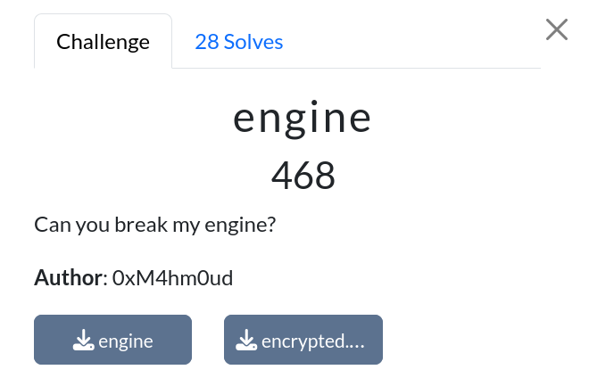
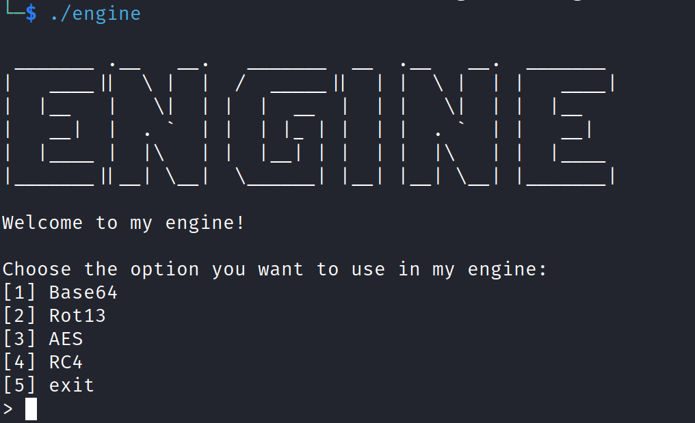
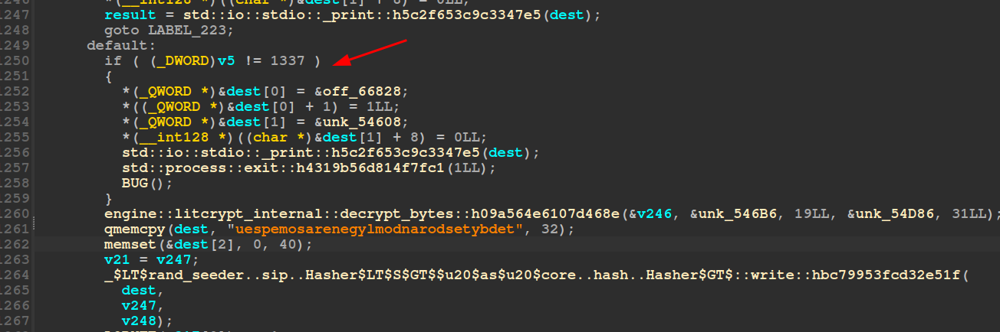
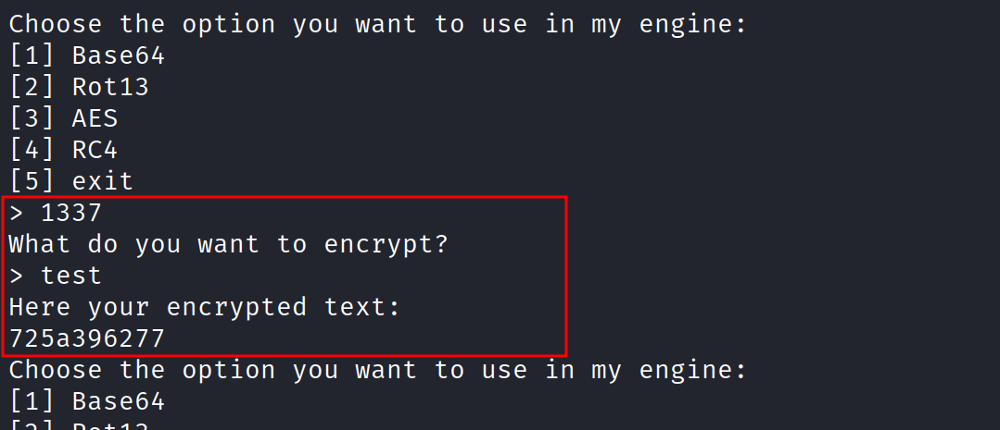
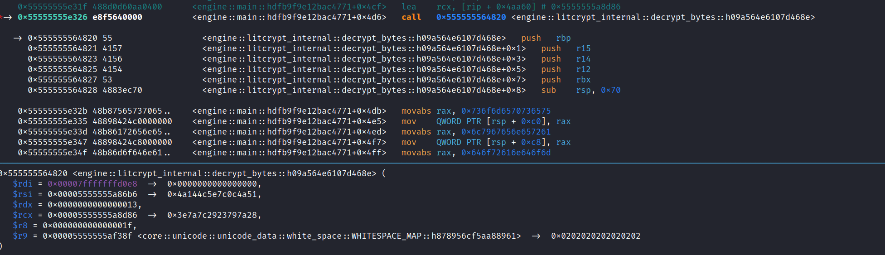
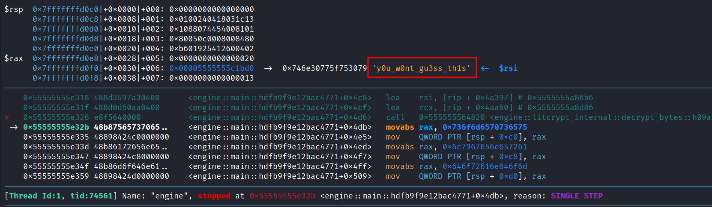
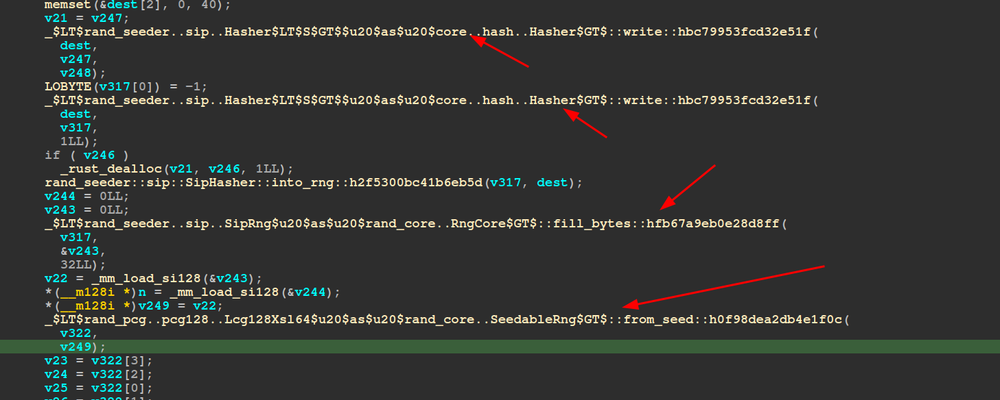
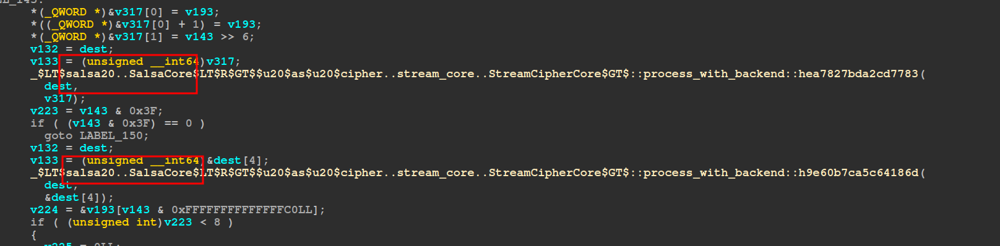
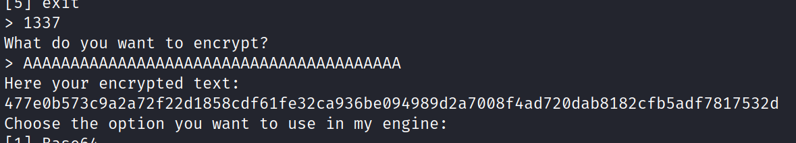
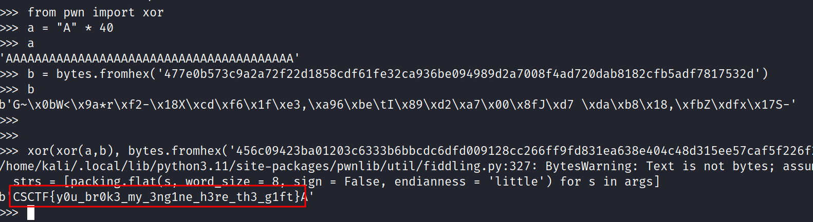

# engine

|              |                                                                                    |
| ------------ | ---------------------------------------------------------------------------------- |
| **CTF**      | [Cyberspace CTF](https://2024.csc.tf/) [(CTFtime)](https://ctftime.org/event/2428) |
| **Author**   | [0xM4hm0ud](https://github.com/0xM4hm0ud)                                          |
| **Category** | Rev                                                                                |
| **Solves**   | 28                                                                                 |
| **Files**    | [engine](engine)                                                                   |



# Solution

We receive a binary along with an encrypted flag. Running the binary reveals four different algorithms for encryption and decryption.



Let’s dive into reversing the binary. The binary is somewhat tricky because the compiler inlined the code, so everything is located within the main function.



After some analysis, we find a while loop, and notice that 1337 is an option.



At this point, we can reverse the `1337` option. Interestingly, some players brute-forced this part during the CTF to get the flag.

Upon further investigation, we see that the binary uses [litcrypt](https://crates.io/crates/litcrypt), which XORs values at compile time using an environment key for encryption. This technique hides strings within the binary.

To uncover the hidden strings, we can set a breakpoint at the decryption point.



By stepping through the instructions, we can view the decrypted data.



Next, the binary passes this data to a seeder and generates a seed.



We discover that it uses [`rand_seeder`](https://docs.rs/rand_seeder/latest/rand_seeder/struct.Seeder.html) and [`rand_pcg`](https://docs.rs/rand_pcg/latest/rand_pcg/).

After this it decrypts another string with litcrypt and do the exact same thing.

After decrypting another string with litcrypt, the binary follows the same process. This reveals two strings: `y0u_w0nt_gu3ss_th1s` and `y3t_4n0th3r_p4ssw0rd`.

By reversing a bit further, we identify that `salsa20` is used for encryption.



It’s likely that the flag is encrypted with salsa20, with the key and nonce being the strings we found earlier, converted to byte seeds using the random seeder. We can replicate this in Rust:

```rust
use rand_pcg::Pcg64;
use rand_seeder::Seeder;
use rand::prelude::*;

fn main() {
    let key = "y0u_w0nt_gu3ss_th1s";
    let nonce = "y3t_4n0th3r_p4ssw0rd";
    let mut keyrng: Pcg64 = Seeder::from(key).make_rng();
    let keyseed = keyrng.gen::<[u8; 32]>();
    let mut noncerng: Pcg64 = Seeder::from(nonce).make_rng();
    let nonceseed = noncerng.gen::<[u8; 8]>();
    println!("{:?}", keyseed);
    println!("{:?}",  nonceseed);
}
```

With this information, we can decrypt the flag. You can find the full script [here](solve.py).

## Unintended

An unintended solution involves XORing, as `salsa20` is a stream cipher/hash function. If the same nonce and key are used for two encryptions, you can use one plaintext and two ciphertexts to retrieve the keystream. XORing the keystream with the second ciphertext yields the flag. This was an interesting unintended solution that I didn't expect.



First, encrypt the known plaintext using the salsa20 algorithm. Then, XOR the data to retrieve the flag.


