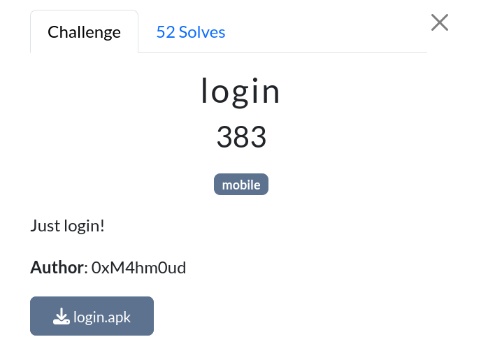
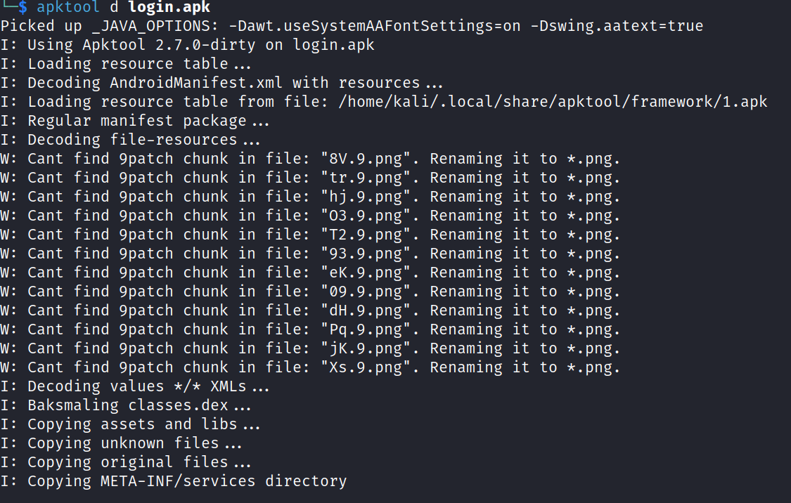
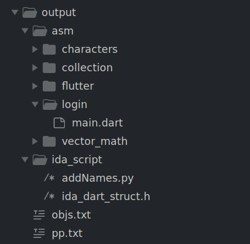
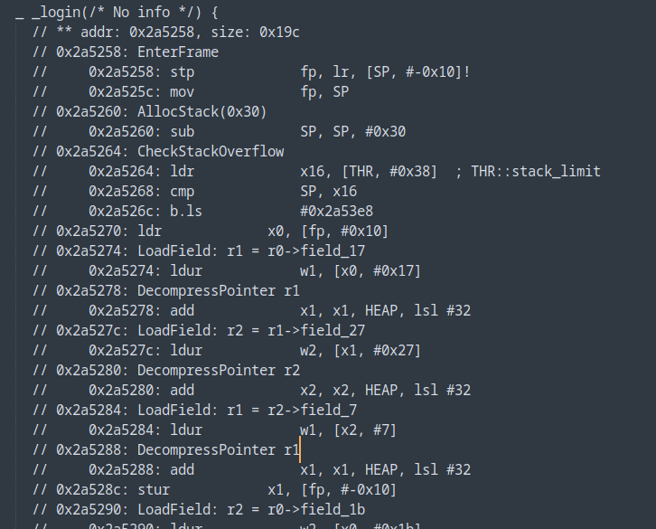
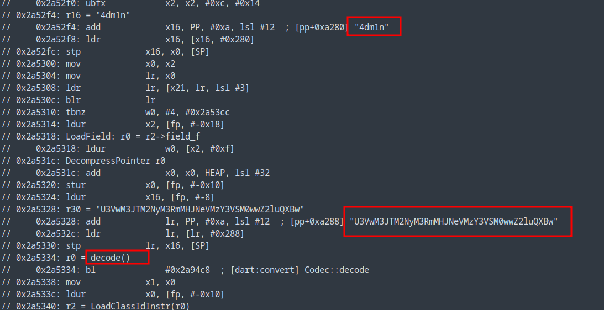
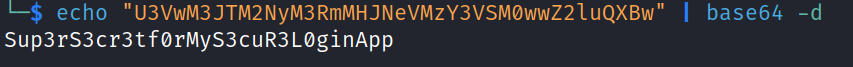
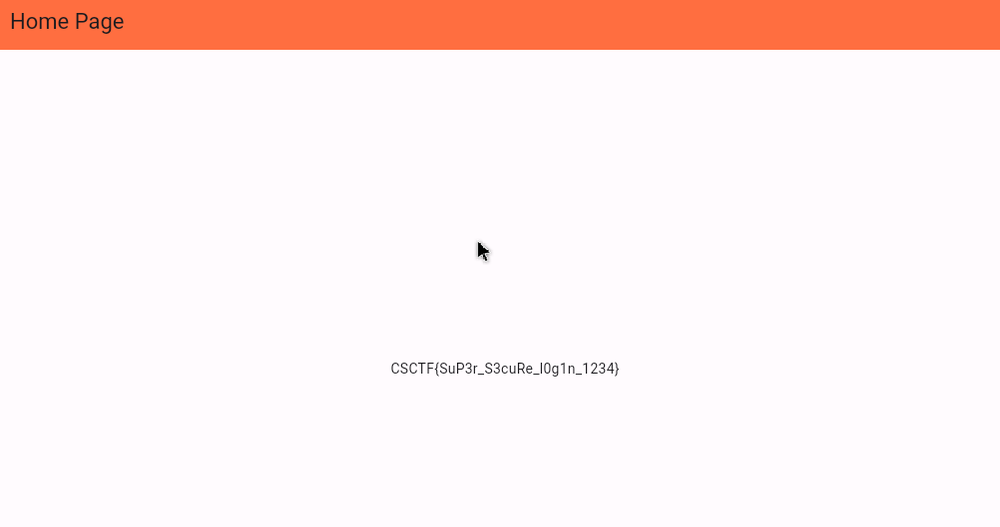

# Login

|              |                                                                                    |
| ------------ | ---------------------------------------------------------------------------------- |
| **CTF**      | [Cyberspace CTF](https://2024.csc.tf/) [(CTFtime)](https://ctftime.org/event/2428) |
| **Author**   | [0xM4hm0ud](https://github.com/0xM4hm0ud)                                          |
| **Category** | Rev                                                                                |
| **Solves**   | 52                                                                                 |
| **Files**    | [login.apk](login.apk)                                                             |



# Solution

This challenge has a mobile tag, and we receive an APK file. Let's start by decompiling it with `apktool`. <br/>
When we open the `AndroidManifest.xml` file, we can see that it's a flutter app, which is indicated by lines like:

```xml
<meta-data android:name="io.flutter.embedding.android.NormalTheme" android:resource="@style/NormalTheme"/>
```

Next, let's inspect the smali code. We observe that the app invokes the `init` function from flutter, confirming that it's built with the flutter framework.

```
.class public Lcom/example/login/MainActivity;
.super Lio/flutter/embedding/android/f;
.source "SourceFile"


# direct methods
.method public constructor <init>()V
    .locals 0

    invoke-direct {p0}, Lio/flutter/embedding/android/f;-><init>()V

    return-void
.end method
```

To reverse flutter apps, the main logic can often be found under the `lib` directory. In this case, we see two files: `libapp.so` and `libflutter.so`.

When running the app, it prompts for a username and password. Given the challenge description, it's likely that the credentials are hardcoded.

To reverse the APK, we'll use [`blutter`](https://github.com/worawit/blutter).

First, we need to open the APK with `apktool` to access the directory that contains `libapp.so`.



Now, let's run `blutter`. Although we encounter some errors, we proceed by using the `arm` directory.


After extracting the contents, we can explore the files:



Navigating to `asm/login/main.dart`, we search for the `login()` function. The Dart assembly code reveals a few interesting strings. Notably, the second string is passed through a `decode` function.



It appears to be Base64 encoded. Let's decode it:





Now, using the credentials `4dm1n:Sup3rS3cr3tf0rMyS3cuR3L0ginApp`, we can log in and obtain the flag.


