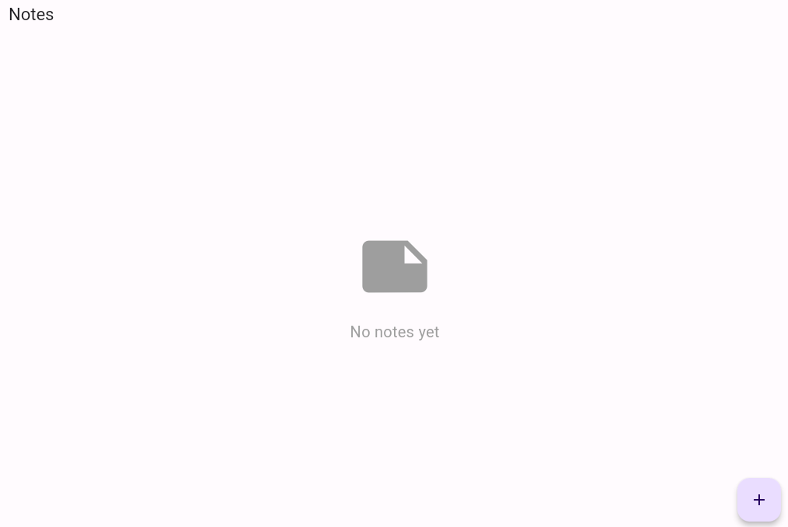

# Secure Notes

|              |                                                                                    |
| ------------ | ---------------------------------------------------------------------------------- |
| **CTF**      | [Cyberspace CTF](https://2024.csc.tf/) [(CTFtime)](https://ctftime.org/event/2428) |
| **Author**   | [0xM4hm0ud](https://github.com/0xM4hm0ud)                                          |
| **Category** | rev                                                                                |
| **Solves**   | 10                                                                                 |
| **Files**    | [securenotes.apk](securenotes.apk)                                                 |


# Solution

This challenge has a mobile tag, and we receive an APK file. Let's start by decompiling it with `apktool`. <br/>
When we open the `AndroidManifest.xml` file, we can see that it's a flutter app, which is indicated by lines like:

```xml
<meta-data android:name="io.flutter.embedding.android.NormalTheme" android:resource="@style/NormalTheme"/>
```

Next, let's inspect the smali code. We observe that the app invokes the `init` function from flutter, confirming that it's built with the flutter framework.

```
.class public Lcom/cyberspace/secure_notes/MainActivity;
.super Lio/flutter/embedding/android/f;
.source "SourceFile"


# direct methods
.method public constructor <init>()V
    .locals 0

    invoke-direct {p0}, Lio/flutter/embedding/android/f;-><init>()V

    return-void
.end method
```

To reverse flutter apps, the main logic can often be found under the `lib` directory. In this case, we see two files: `libapp.so` and `libflutter.so`.

When running the app, we can see that we can register or log in.


After registering and logging in, we can create, delete, and view notes.

  

The app interacts with a remote server, and we can try to intercept the requests using Burpsuite. However, interception doesn’t seem to work because of SSL pinning.

To bypass SSL pinning on Flutter, we can use tools like [`reflutter`](https://github.com/ptswarm/reFlutter).

In this case, I used [httptoolkit](https://httptoolkit.com/). After installing the tool, I connected my Android machine with ADB:

```
adb connect ip:port
```

Running httptoolkit on my Linux machine, I clicked on `Android Device via ADB.`


The tool automatically checks the connection, installs the httptoolkit app on the Android machine, and installs certificates:

 

Now, I can interact with the app and see the requests in httptoolkit. We've successfully bypassed SSL pinning on flutter, and can view all the requests:


By inspecting the notes endpoint, we see that it returns the notes we've created. The server knows this because a JWT token is being sent via the Authorization header:


Let's examine the contents of the JWT token:


Two interesting things stand out: the JWT uses the `HS256` algorithm, and the `sub` field in the payload is a claim (a number). We can attempt to crack the token's signature and sign our own cookie, changing the sub value to 1 to impersonate the admin and access their notes.

By copying the token's signature into a file and running hashcat on it:


We quickly retrieve the secret password:


Now, using this secret on `jwt.io`, we can verify the signature, change the sub value to 1, and copy the new token.

Switching to Burpsuite (since httptoolkit's free version lacks certain features), we send the modified request to the notes endpoint using the admin token. However, we receive a 403 Forbidden error. The same happens when using our original token:


The app works fine, but the server prevents direct access via Burpsuite or curl. The server likely checks if the request originates from the app. A key way it might do this is by using the User-Agent header.

Checking the User-Agent through httptoolkit:


We can modify the User-Agent header in Burpsuite to match the app's. After doing this, the request succeeds, and we can view our notes. Changing the sub value to 1 allows access to the admin's notes and reveals the flag:


