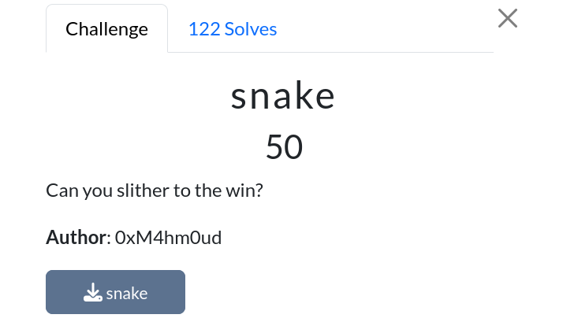
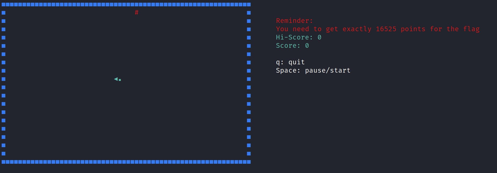
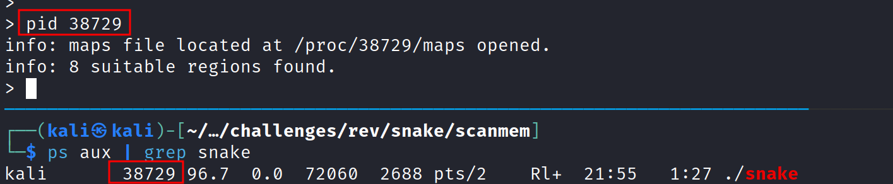
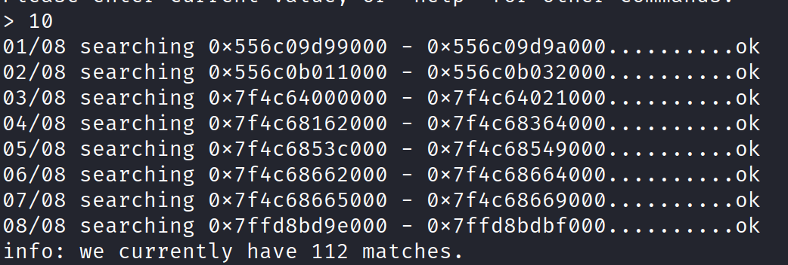
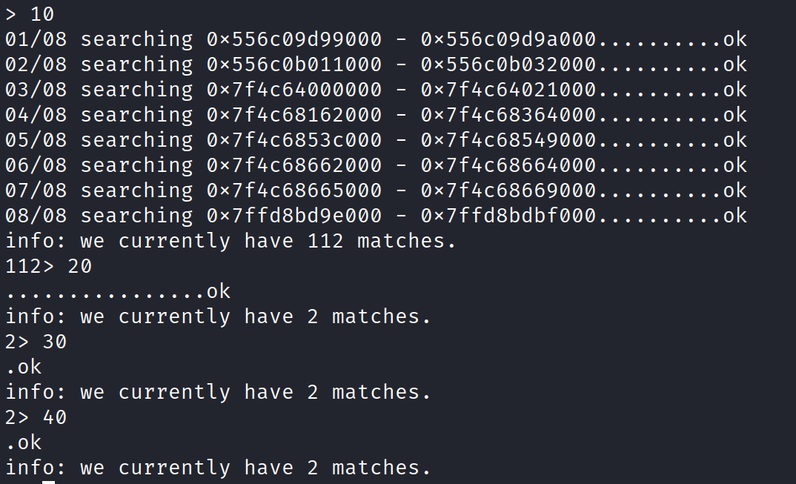
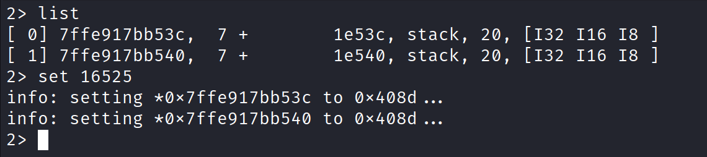
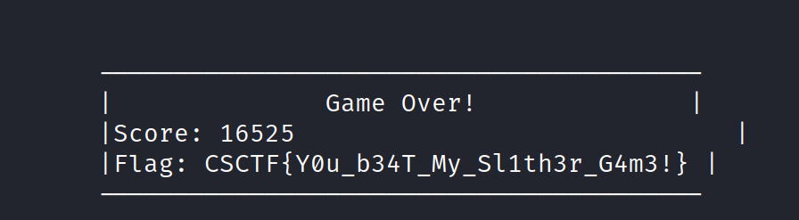

# snake

|              |                                                                                    |
| ------------ | ---------------------------------------------------------------------------------- |
| **CTF**      | [Cyberspace CTF](https://2024.csc.tf/) [(CTFtime)](https://ctftime.org/event/2428) |
| **Author**   | [0xM4hm0ud](https://github.com/0xM4hm0ud)                                          |
| **Category** | Rev                                                                                |
| **Solves**   | 122                                                                                |
| **Files**    | [snake](snake)                                                                     |

# Solution

We receive a binary, and the description references a game. When we run the binary, we discover that it's a snake game.

To get the flag, we need to score 16525 points. Since eating one item only gives 10 points, it's practically impossible to beat the game through regular play.

There are two ways to beat this game: manual reversing or dynamic reversing. The manual approach involves using IDA, Ghidra, or another tool to reverse the binary, find the function that checks the score, and patch it. The other method is dynamic, using a tool like [scanmem](https://github.com/scanmem/scanmem).

Since the binary is written in Rust, using scanmem is the easier option.

First, install and build scanmem, then run it alongside the game. Pausing the game can make it easier to find values.

After pausing the game, launch scanmem and find the game's PID.

Once scanmem is attached, run a command to search for your current score. Eat one item to get 10 points and then search for that value.

Continue eating more items and narrow down the search in scanmem by updating the score.

Eventually, you'll narrow it down to one or two possible values. Change it to 16525 to get the flag.

If you resume the game after changing the score, you’ll receive the flag immediately.

