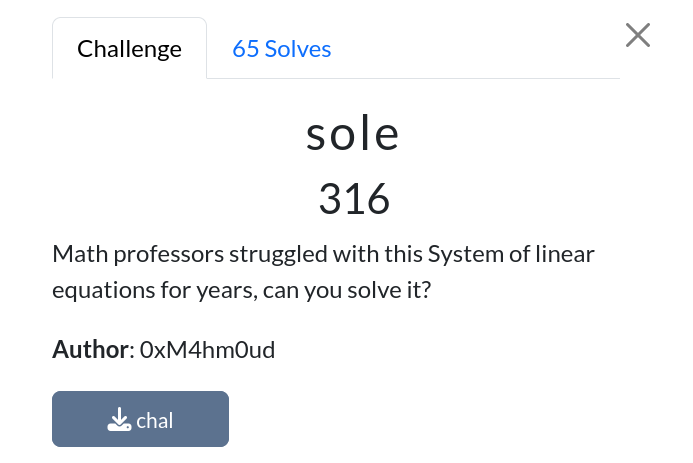
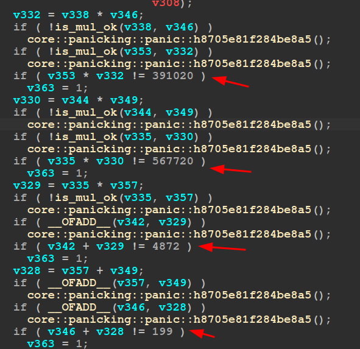

# sole

|              |                                                                                    |
| ------------ | ---------------------------------------------------------------------------------- |
| **CTF**      | [Cyberspace CTF](https://2024.csc.tf/) [(CTFtime)](https://ctftime.org/event/2428) |
| **Author**   | [0xM4hm0ud](https://github.com/0xM4hm0ud)                                          |
| **Category** | Rev                                                                                |
| **Solves**   | 65                                                                                 |
| **Files**    | [chal](chal)                                                                       |

# Solution

We receive a binary, and the description mentions `linear equations`. When we run the binary, it prompts us to enter a flag. Let's reverse the binary to solve it.

Upon inspecting the main function, we find a lot of equations. If all of them are correct, you have the flag.

We can copy all the equations and use AI to convert them into a script, or we can do it manually. Ultimately, we create a Z3 script with all the equations.

When we run the script, we get the flag.

You can view the full script [here](solve.py).
