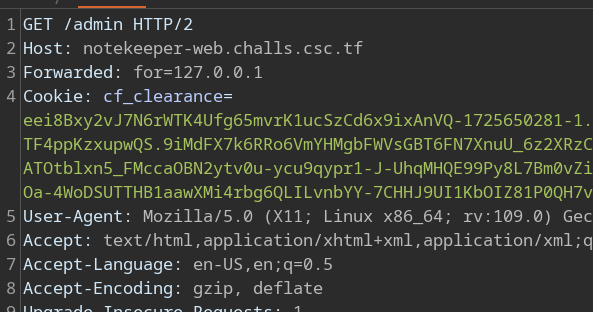

# Notekeeper

|              |                                                                                    |
| ------------ | ---------------------------------------------------------------------------------- |
| **CTF**      | [Cyberspace CTF](https://play.csc.tf/) [(CTFtime)](https://ctftime.org/event/2428) |
| **Author**   | [0xM4hm0ud](https://github.com/0xM4hm0ud)                                          |
| **Category** | Web                                                                                |
| **Solves**   | 19                                                                                 |
| **Files**    | [handout_notekeeper.zip](handout_notekeeper.zip)                                   |


# Solution

We received a ZIP file containing the source code. Let's open the ZIP file and review the source code.

Upon opening, we see a structure like this:


## Configuration

We received files for local deployment. We can see that we can't read the flag directly. We need to execute a binary. Additionally, we noticed that `request.rb` is patched from `rack`.

```Dockerfile
# Copyright 2020 Google LLC
#
# Licensed under the Apache License, Version 2.0 (the "License");
# you may not use this file except in compliance with the License.
# You may obtain a copy of the License at
#
#     https://www.apache.org/licenses/LICENSE-2.0
#
# Unless required by applicable law or agreed to in writing, software
# distributed under the License is distributed on an "AS IS" BASIS,
# WITHOUT WARRANTIES OR CONDITIONS OF ANY KIND, either express or implied.
# See the License for the specific language governing permissions and
# limitations under the License.
FROM ruby:3.3 as chroot

RUN mkdir -p /home/user
WORKDIR /home/user

COPY app/ patch.txt ./
RUN gem install bundler:2.5.14
RUN bundle install
RUN patch /usr/local/bundle/gems/rack-3.1.7/lib/rack/request.rb < patch.txt

COPY flag.c /
RUN gcc /flag.c -o /flag && rm /flag.c && chmod -r+x /flag

FROM gcr.io/kctf-docker/challenge@sha256:0f7d757bcda470c3bbc063606335b915e03795d72ba1d8fdb6f0f9ff3757364f

COPY --from=chroot / /chroot

COPY nsjail.cfg /home/user/
COPY start.sh /chroot/home/user/

CMD kctf_setup && \
    kctf_drop_privs nsjail --config /home/user/nsjail.cfg -- /home/user/start.sh
```

We also see a `start.sh` script:

```bash
#!/bin/bash

export PATH=$PATH:/usr/local/bundle/bin
export BUNDLE_APP_CONFIG=/usr/local/bundle
export GEM_HOME=/usr/local/bundle

cd /home/user || exit
/usr/local/bundle/bin/rackup -E deployment -o 0.0.0.0 -p 1337
```

We can see that this simply runs the local Ruby server inside the container on port 1337.

## Ruby source code

Let's check the Gemfile to see which gems are used in this application:

```gemfile
source "https://rubygems.org"

gem "rackup"
gem "cuba"
gem "tilt"
gem "sqlite3"
gem "rack-session"
gem "open3"
```

We can see various gems listed. Inside the container, it will install the gems with the latest version of Bundler, ensuring there are no vulnerabilities in the gems themselves.

We also see a `config.ru` file:

```ruby
require "./server"

run Cuba
```

This will run Cuba. If we search for Cuba, we can find it on [Github](https://github.com/soveran/cuba).<br/>
Cuba is a microframework for web development, originally inspired by Rum, a tiny but powerful mapper for Rack applications.

So, it's a framework that can be used with Ruby.

We can see that Cuba runs the server, and the server is defined in `server.rb`.
In server.rb, we observe different `POST` and `GET` endpoints.

Additionally, we notice that the session secret is REDACTED, and we use Safe and Render from Cuba itself.

```ruby
Cuba.use Rack::Session::Cookie, :key => 'session', :secret => 'REDACTEDREDACTEDREDACTEDREDACTEDREDACTEDREDACTEDREDACTEDREDACTED'
Cuba.plugin Cuba::Safe
Cuba.plugin Cuba::Render
```

As we can read on Github, we can see:

```
When building a web application, you need to include a security layer. Cuba ships with the Cuba::Safe plugin, which applies several security related headers to prevent attacks like clickjacking and cross-site scripting, among others.
```

This plugin provides extra security. The render plugin allows us to render template files. As we can see in the `views` directory, the application uses `erb`.

We also notice a custom function called `h`:

```ruby
def h(text)
  Rack::Utils.escape_html(text)
end
```

This function is used in the template files to prevent XSS.
Now that we have a rough understanding of the protections in place and how the server operates, we can dive into the vulnerabilities and exploitation.

## Vulnerabilities

When reviewing the different endpoints, we found some interesting ones with specific checks.

For example, the `admin` and `download` endpoints have a check to see if `req.ip` is equal to `127.0.0.1`:

```ruby
    on "admin" do
      begin
        if session[:user] == nil
          res.status = 403
          res.headers["Content-Type"] = "text/html"
          res.write partial("403")
        else
          if req.ip == "127.0.0.1"
            files = Dir.each_child(report_path)
            res.write partial("admin", error: "", user: session[:user], files: files, content: "")
          else
            res.status = 403
            res.headers["Content-Type"] = "text/html"
            res.write partial("403")
          end
        end
      rescue
        res.status = 500
        res.headers["Content-Type"] = "text/html"
        res.write partial("500")
      end
    end
```

The `flag` endpoint has an additional check:

```ruby
    on "flag" do
      begin
        if session[:user] == "admin"
          if req.ip == "127.0.0.1"
            stdout, status = Open3.capture2("/flag")
            res.write stdout
          else
            res.status = 403
            res.headers["Content-Type"] = "text/html"
            res.write partial("403")
          end
        else
            res.status = 403
            res.headers["Content-Type"] = "text/html"
            res.write partial("403")
        end
      rescue
        res.status = 500
        res.headers["Content-Type"] = "text/html"
        res.write partial("500")
      end
    end
```

It checks if the user is an admin.
So, we can't access certain endpoints unless we are an admin and have an IP address of `127.0.0.1`.

Can we try to register as an admin? No, we should check the register and login functions in `database.db`:

```ruby
	def register(username, password)
		if username != "admin" && !checkSameUsername(username)
			@db.execute("INSERT INTO accounts (username, password) VALUES (?,?);", [username, password])
			return true
		else
			return false
		end
	end

	def login(username, password)
		if username != "admin"
			@db.execute("SELECT * FROM accounts WHERE username = ? AND password= ?;", [username, password]).each do | row |
				if row[1] == username && row[2] == password
					return true
				else
					return false
				end
			end
			return false
		else
			return false
		end
	end
```

We see here that we can't register or log in as an admin, so there must be another way.

Aside from creating or deleting notes, we notice two other important endpoints:

```ruby
on "report" do
      begin
        if session[:user] == nil
          res.redirect "/login"
        else
          on param("title"), param("report") do |title, report|
            t = Time.new
            time = t.strftime("%k:%M:%S")
            date = t.strftime("%d-%m-%Y")
            fulldate = time + "_" + date

            file = File.new(report_path + "report_" + fulldate + ".txt", "w")
            File.open(file, "w") do |report_file|
              report_file.puts("Title:")
              report_file.puts(title)
              report_file.puts("<br/>")
              report_file.puts("Report:")
              report_file.puts(report)
              report_file.puts("<br/>")
              report_file.puts("User:")
              report_file.puts(session[:user])
            end
            res.write partial("report", user: session[:user], error: "", success: "Your report has been successfully sent!")
          end
          on param("title") do
            res.write partial("report", user: session[:user], error: "Both fields are required!", success: "")
          end
          on param("report") do
            res.write partial("report", user: session[:user], error: "Both fields are required!", success: "")
          end
          res.write partial("report", user: session[:user], error: "You can't send an empty report!", success: "")
        end
      rescue
        res.status = 500
        res.headers["Content-Type"] = "text/html"
        res.write partial("500")
      end
    end

    on "download" do
      begin
        if session[:user] == nil
            res.status = 403
            res.headers["Content-Type"] = "text/html"
            res.write partial("403")
        else
          if req.ip == "127.0.0.1"
            on param("filename") do |filename|
              file = File.join(report_path, filename)
              if File.exist?(file)
                content = File.open(file).read()
                files = Dir.each_child(report_path)
                res.write partial("admin", error: "File doesn't exist!", user: session[:user], files: files, content: content)
              else
                files = Dir.each_child(report_path)
                res.write partial("admin", error: "File doesn't exist!", user: session[:user], files: files, content: "")
              end
            end
          else
            res.status = 403
            res.headers["Content-Type"] = "text/html"
            res.write partial("403")
          end
        end
      rescue
        res.status = 500
        res.headers["Content-Type"] = "text/html"
        res.write partial("500")
      end
    end
```

When reporting on the site, the data will be saved in a .txt file on the machine. We don't control anything regarding the filename, and our input will be saved directly into the `.txt` file, so this isn't vulnerable to anything specific.

In the download endpoint, the filename is taken from the filename parameter and then joined with the report_path.
report_path is defined as:

```ruby
report_path = File.expand_path(".") + "/reports/"
```

It then checks if the file exists. If it does, it reads the file's contents and displays them on the page. We can see that there isn't any additional check here, so there is a Path Traversal vulnerability. We only need to bypass the IP check.

### Patch

We noticed a patch. Let's examine what it contains:

```patch
418,421d417
<         unless external_addresses.empty?
<           return external_addresses.last
<         end
<
```

If we look for this in `request.rb`, we can see that it's inside a function called [`ip`](https://github.com/rack/rack/blob/main/lib/rack/request.rb#L414). It's defined as follows:

```ruby
  def ip
        remote_addresses = split_header(get_header('REMOTE_ADDR'))
        external_addresses = reject_trusted_ip_addresses(remote_addresses)

        unless external_addresses.empty?
          return external_addresses.last
        end

        if (forwarded_for = self.forwarded_for) && !forwarded_for.empty?
          # The forwarded for addresses are ordered: client, proxy1, proxy2.
          # So we reject all the trusted addresses (proxy*) and return the
          # last client. Or if we trust everyone, we just return the first
          # address.
          return reject_trusted_ip_addresses(forwarded_for).last || forwarded_for.first
        end

        # If all the addresses are trusted, and we aren't forwarded, just return
        # the first remote address, which represents the source of the request.
        remote_addresses.first
      end
```

What this function does is check for remote addresses. It then calls `reject_trusted_ip_addresses`, which checks if the IP is from localhost, including `192.` and `172` IP ranges. If the IP is not from localhost, the function returns directly. The patch modifies this behavior by removing the check that returns if the IP in `remote_addr` is external. It then checks for a forwarded header inside the `forwarded_for` function.

```ruby
      def forwarded_for
        forwarded_priority.each do |type|
          case type
          when :forwarded
            if forwarded_for = get_http_forwarded(:for)
              return(forwarded_for.map! do |authority|
                split_authority(authority)[1]
              end)
            end
          when :x_forwarded
            if value = get_header(HTTP_X_FORWARDED_FOR)
              return(split_header(value).map do |authority|
                split_authority(wrap_ipv6(authority))[1]
              end)
            end
          end
        end

        nil
      end
```

Here, it checks for two types of headers: `Forwarded` and `X-Forwarded-For`. We can use these headers to set the IP to `127.0.0.1`. Locally, X-Forwarded-For works, but the challenge was deployed on GCP (Google Cloud Platform). GCP's load balancer modifies the header, as noted [here](https://cloud.google.com/load-balancing/docs/https#x-forwarded-for_header).

> During the CTF, people opened tickets about this issue. I was aware of it, but then someone solved the challenge. To ensure fairness, I didn't update the challenge but made an announcement to inform the players.

The workaround that worked was using the [`forwarded`](https://developer.mozilla.org/en-US/docs/Web/HTTP/Headers/Forwarded) header. The code checks for both headers, so this approach was effective.


By using the header to spoof our IP, we can access the download endpoint and achieve Local File Inclusion (LFI). With LFI, we can read files from the container. Our goal is to become an admin so that we can call the flag endpoint and retrieve the flag. We saw earlier that the session secret was REDACTED, so we can leak the secret, replace it locally to create a valid admin session token, and use it on the remote server to obtain the flag. Let's see this in action.

## Exploitation

When we try to access `/admin`, we get a 403 page:


If we intercept the request and add the Forwarded header (Forwarded: for=127.0.0.1), we can see the page:




Let's intercept the request when clicking on a report. We can see the `filename` parameter:


We can successfully view the passwd file:


Next, we read the secret from secret.rb:


Now, by replacing the secret locally, editing the database.db file to allow admin access, creating an account, and using the cookie on the remote server, we can access `/flag`.
